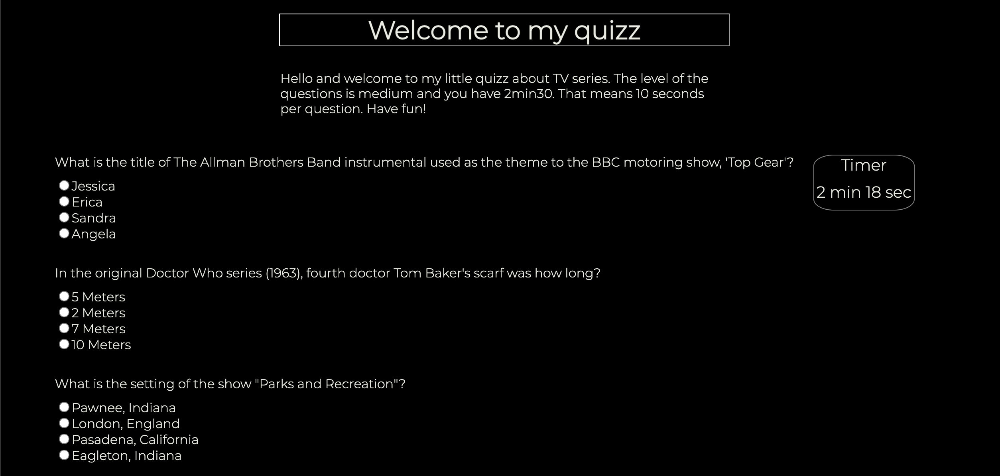

# Quizz

* Solo project made by me [Joelle Everaert](https://github.com/Joelle-Everaert)

* Date : 14/12/2020

## What is this ?
It is a solo work as part of my training at **[BeCode](https://becode.org)**.  

[Trello](https://trello.com/b/iMYkjSat/restaurant)

## Context  
As part of our training, we finish the front end with 4 different projects. This is project 4.  
We had to create a quiz using an API. 
## Purpose?
Putting our knowledge and cohesion into practice through teamwork.

## Languages used?
* HTML
* CSS
    * Flexbox
* Javascript
    
## Improvement
* 

## Overview 
 

### Original instruction

[Link](https://github.com/becodeorg/bxl-hopper-1-25/tree/master/The%20Hill/projects/99.leaving_the_hills)